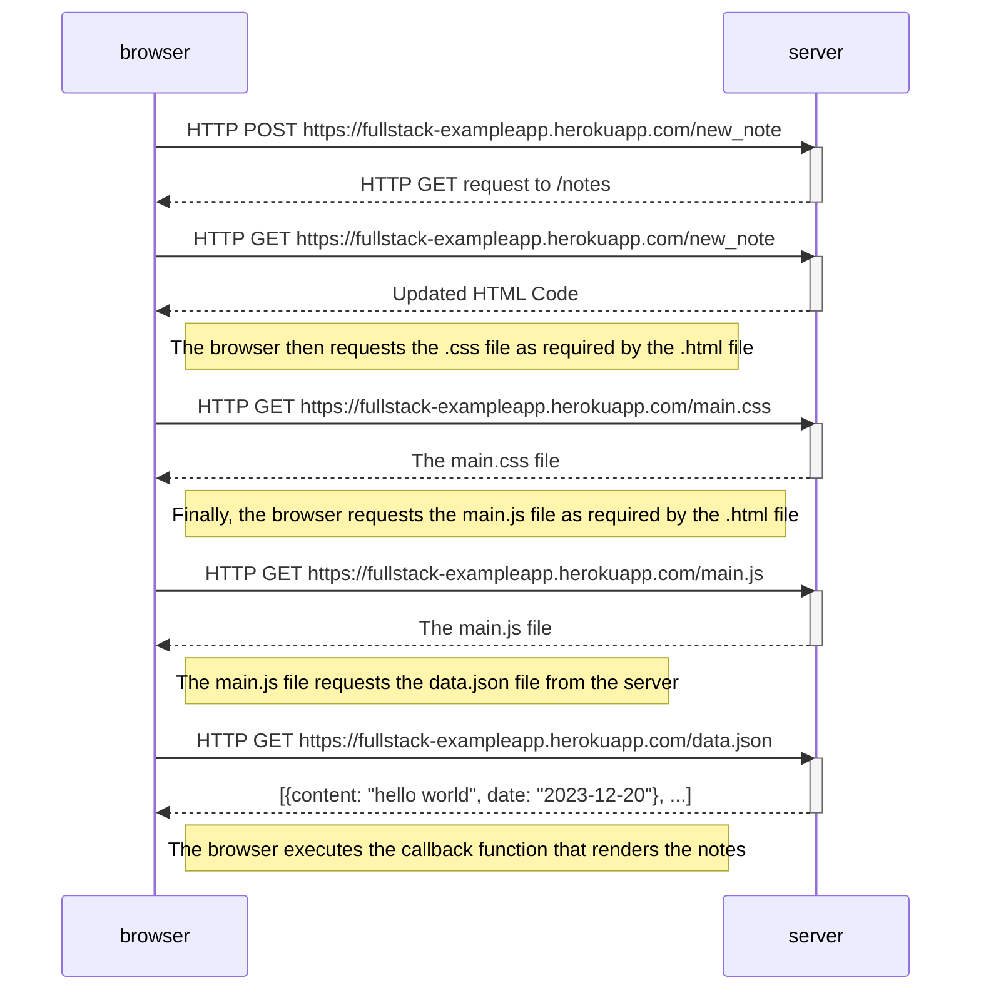

```mermaid

sequenceDiagram
    participant browser
    participant server

    browser->>server: HTTP POST https://fullstack-exampleapp.herokuapp.com/new_note
    activate server
    server-->>browser: HTTP GET request to /notes
    deactivate server

    browser->>server: HTTP GET https://fullstack-exampleapp.herokuapp.com/new_note
    activate server
    server-->>browser: Updated HTML Code
    deactivate server

    Note right of browser: The browser then requests the .css file as required by the .html file
    browser->>server: HTTP GET https://fullstack-exampleapp.herokuapp.com/main.css
    activate server
    server-->>browser: The main.css file
    deactivate server

    
    Note right of browser: Finally, the browser requests the main.js file as required by the .html file
    browser->>server: HTTP GET https://fullstack-exampleapp.herokuapp.com/main.js
    activate server
    server-->>browser: The main.js file
    deactivate server

    Note right of browser: The main.js file requests the data.json file from the server
    browser->>server: HTTP GET https://fullstack-exampleapp.herokuapp.com/data.json
    activate server
    server-->>browser: [{content: "hello world", date: "2023-12-20"}, ...]
    deactivate server

    Note right of browser: The browser executes the callback function that renders the notes
```