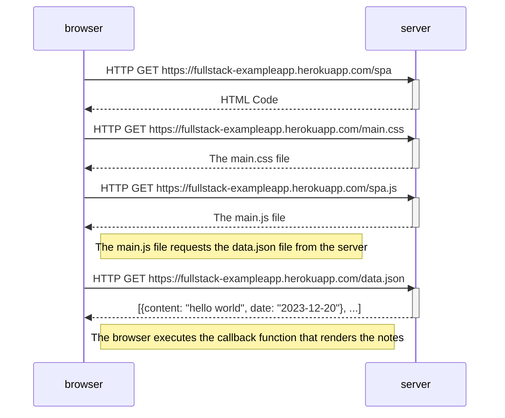

```mermaid

sequenceDiagram
    participant browser
    participant server

    browser->>server: HTTP GET https://fullstack-exampleapp.herokuapp.com/spa
    activate server
    server-->>browser: HTML Code
    deactivate server

    browser->>server: HTTP GET https://fullstack-exampleapp.herokuapp.com/main.css
    activate server
    server-->>browser: The main.css file
    deactivate server

    browser->>server: HTTP GET https://fullstack-exampleapp.herokuapp.com/spa.js
    activate server
    server-->>browser: The main.js file
    deactivate server

    Note right of browser: The main.js file requests the data.json file from the server
    browser->>server: HTTP GET https://fullstack-exampleapp.herokuapp.com/data.json
    activate server
    server-->>browser: [{content: "hello world", date: "2023-12-20"}, ...]
    deactivate server

    Note right of browser: The browser executes the callback function that renders the notes
```